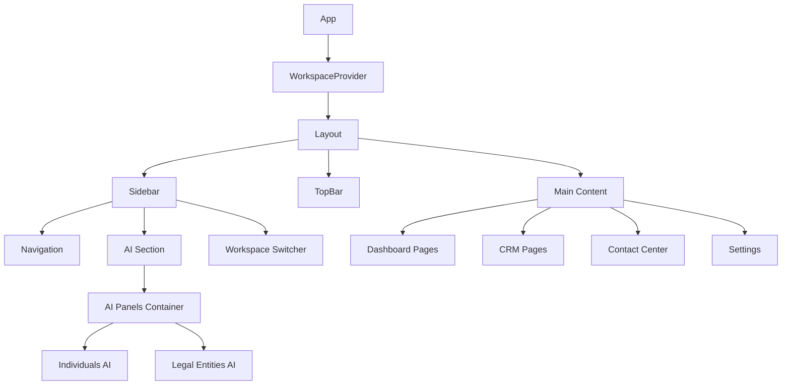

# ЛОГАЗ - Техническая документация

<div align="center">
  <h3>Полная техническая документация системы управления лояльностью</h3>
  <p><strong>Версия документации:</strong> 1.0.0 | <strong>Дата обновления:</strong> 25 мая 2025</p>
</div>

---

## 📑 Содержание

1. [Введение](#введение)
2. [Архитектура проекта](#архитектура-проекта)
3. [Техническая спецификация](#техническая-спецификация)
4. [Компоненты и модули](#компоненты-и-модули)
5. [Управление состоянием](#управление-состоянием)
6. [UI/UX документация](#uiux-документация)
7. [Структура данных](#структура-данных)
8. [Развертывание](#развертывание)
9. [Безопасность](#безопасность)
10. [Производительность](#производительность)
11. [Roadmap](#roadmap)
12. [Приложения](#приложения)

---

## 1. Введение

### 1.1 Цель проекта
ЛОГАЗ - это комплексная система управления лояльностью клиентов, специально разработанная для сети автозаправочных станций. Система предоставляет полный набор инструментов для управления взаимоотношениями с клиентами, автоматизации маркетинга и администрирования программ лояльности через современную веб-панель управления.

### 1.2 Область применения
- **Основная аудитория:** Сеть АГЗС ЛОГАЗ SV
- **Типы пользователей:** Менеджеры, маркетологи, аналитики, администраторы
- **Сферы применения:** Лояльность клиентов, CRM, аналитика продаж, управление контентом

### 1.3 Ключевые особенности
- **Мультиворкспейс архитектура** - отдельные рабочие пространства для физических и юридических лиц
- **Интегрированный ИИ-ассистент** - контекстная помощь и аналитические инсайты
- **Адаптивный дизайн** - полная поддержка мобильных устройств
- **Реактивный интерфейс** - мгновенное обновление данных

### 1.4 Ограничения и допущения
- **Платформа разработки:** Ограничено возможностями Lovable
- **Данные:** Использование mock-данных для демонстрации
- **Аутентификация:** Упрощенная система для прототипа
- **Хранение:** Локальное состояние без персистентности

### 1.5 Определения и сокращения
| Термин | Определение |
|--------|-------------|
| АГЗС | Автогазозаправочная станция |
| CRM | Customer Relationship Management |
| RFM | Recency, Frequency, Monetary - модель анализа клиентов |
| AI | Artificial Intelligence - Искусственный интеллект |
| B2B | Business to Business - сегмент юридических лиц |
| B2C | Business to Consumer - сегмент физических лиц |

---

## 2. Архитектура проекта

### 2.1 Общая архитектура
```
┌─────────────────────────────────────────────────────────────┐
│                    Lovable Cloud Platform                   │
├─────────────────────────────────────────────────────────────┤
│  ┌─────────────────┐    ┌─────────────────┐                │
│  │   React Frontend │    │   Mock Data     │                │
│  │   (TypeScript)   │◄──►│   Layer         │                │
│  └─────────────────┘    └─────────────────┘                │
├─────────────────────────────────────────────────────────────┤
│                    Component Architecture                    │
│  ┌─────────────────┐    ┌─────────────────┐                │
│  │   Layout        │    │   Feature       │                │
│  │   Components    │◄──►│   Components    │                │
│  └─────────────────┘    └─────────────────┘                │
└─────────────────────────────────────────────────────────────┘
```

### 2.2 Архитектурные принципы
- **Component-Based Architecture** - модульная структура с переиспользуемыми компонентами
- **Context-Driven State Management** - использование React Context для глобального состояния
- **Feature-First Organization** - группировка по функциональности, не по типу файлов
- **Responsive Design First** - мобильно-ориентированный подход к дизайну

### 2.3 Диаграмма компонентов


### 2.4 Структура директорий
```
src/
├── components/                 # React компоненты
│   ├── ui/                    # Базовые UI компоненты (shadcn/ui)
│   ├── Layout/                # Компоненты макета
│   ├── Dashboard/             # Компоненты дашборда
│   ├── Clients/               # Компоненты управления клиентами
│   ├── ContactCenter/         # Компоненты контакт-центра
│   ├── ai-assistant/          # ИИ-ассистент компоненты
│   └── workspace-switcher/    # Переключатель рабочих пространств
├── pages/                     # Страницы приложения
│   ├── legal-entities/        # Страницы для юридических лиц
│   └── ContactCenter/         # Страницы контакт-центра
├── contexts/                  # React Context провайдеры
├── hooks/                     # Кастомные React хуки
├── types/                     # TypeScript определения типов
├── data/                      # Mock данные и константы
├── utils/                     # Утилитарные функции
└── lib/                       # Библиотеки и конфигурации
```

---

## 3. Техническая спецификация

### 3.1 Технологический стек

#### Frontend Core
| Технология | Версия | Назначение | Документация |
|------------|--------|------------|--------------|
| React | 18.3.1 | Основной UI framework | [React Docs](https://react.dev) |
| TypeScript | 5+ | Статическая типизация | [TypeScript Docs](https://typescriptlang.org) |
| Vite | Latest | Сборщик и dev-сервер | [Vite Docs](https://vitejs.dev) |

#### UI и Стилизация
| Технология | Версия | Назначение |
|------------|--------|------------|
| Tailwind CSS | 3+ | Utility-first CSS framework |
| shadcn/ui | Latest | Готовые React компоненты |
| Radix UI | Latest | Headless UI примитивы |
| Lucide React | 0.462.0 | Иконки |

#### Маршрутизация и Состояние
| Технология | Версия | Назначение |
|------------|--------|------------|
| React Router | 6+ | Клиентская маршрутизация |
| TanStack Query | 5.56.2 | Управление серверным состоянием |
| React Context | Built-in | Глобальное состояние приложения |

#### Дополнительные библиотеки
| Технология | Версия | Назначение |
|------------|--------|------------|
| Recharts | 2.12.7 | Графики и диаграммы |
| Date-fns | 3.6.0 | Работа с датами |
| Sonner | 1.5.0 | Toast уведомления |

### 3.2 Системные требования

#### Поддерживаемые браузеры
- **Chrome:** 90+ (рекомендуется 100+)
- **Firefox:** 88+ (рекомендуется 95+)
- **Safari:** 14+ (рекомендуется 15+)
- **Edge:** 90+ (рекомендуется 100+)

#### Разрешения экрана
- **Минимальное:** 320px (мобильные устройства)
- **Планшеты:** 768px - 1024px
- **Десктоп:** 1024px+
- **Большие экраны:** 1440px+

#### Производительность
- **Время загрузки:** < 3 секунд
- **First Contentful Paint:** < 1.5 секунд
- **Time to Interactive:** < 4 секунд
- **Bundle Size:** ~500KB (gzipped)

---

## 4. Компоненты и модули

### 4.1 Иерархия Layout компонентов
```
Layout
├── TopBar
│   ├── Logo
│   ├── SearchBar (placeholder)
│   └── UserActions
├── Sidebar
│   ├── SidebarLogo
│   ├── WorkspaceSwitcher
│   ├── Navigation
│   │   └── SidebarNavItem[]
│   └── SidebarAISection
└── Main Content Area
```

### 4.2 Описание ключевых компонентов

#### 4.2.1 Layout/Layout.tsx
```typescript
interface LayoutProps {
  children: React.ReactNode;
}
```
**Назначение:** Главный контейнер приложения с провайдерами
**Провайдеры:** AIProvider, IndividualsAIProvider, LegalEntitiesAIProvider, SidebarProvider
**Особенности:** Содержит AIPanelsContainer для ИИ-ассистентов

#### 4.2.2 Layout/Sidebar.tsx
```typescript
interface SidebarProps {
  isOpen: boolean;
}
```
**Функциональность:**
- Адаптивная навигация (64px → 20px при сворачивании)
- Динамическое меню в зависимости от workspace
- Интегрированный ИИ-ассистент
- Переключатель рабочих пространств

#### 4.2.3 Layout/SidebarAISection.tsx
```typescript
interface SidebarAISectionProps {
  isOpen: boolean;
}
```
**Возможности:**
- Переключатель состояния ИИ
- Отображение критических уведомлений
- Кнопка открытия панели ассистента
- Индикатор текущего режима работы

### 4.3 Система навигации

#### 4.3.1 Структура навигации
Приложение использует двухуровневую систему рабочих пространств:

**Физические лица (Individuals):**
- Dashboard
- CRM (Клиенты, Аудитории)
- Контакт-центр
- Настройки

**Юридические лица (Legal Entities):**
- Dashboard
- Клиенты B2B
- Контакт-центр B2B
- Настройки

#### 4.3.2 Навигационные утилиты
```typescript
// utils/navigation/navigationUtils.ts
export const findItemById = (items: NavigationItem[], id: string) => NavigationItem | undefined
export const getItemPath = (items: NavigationItem[], id: string) => string | undefined
export const hasChildren = (item: NavigationItem) => boolean
export const isActive = (item: NavigationItem, currentPath: string) => boolean
```

### 4.4 Кастомные хуки

#### 4.4.1 useWorkspaceAI
```typescript
export const useWorkspaceAI = () => {
  currentWorkspace: WorkspaceType;
  currentAI: BaseAIState;
  openCurrentPanel: () => void;
  getCurrentMetrics: () => BaseAIMetrics;
  getCriticalAlerts: () => number;
  getWorkspaceDisplayName: () => string;
}
```
**Назначение:** Управление ИИ-ассистентом в контексте текущего workspace
**Особенности:** Автоматическое переключение между контекстами ИИ

#### 4.4.2 useNavigation
```typescript
export const useNavigation = () => {
  navigationItems: NavigationItem[];
  currentPath: string;
  currentWorkspace: WorkspaceType;
  findItemById: (id: string) => NavigationItem | undefined;
  getItemPath: (id: string) => string | undefined;
  hasChildren: (item: NavigationItem) => boolean;
  isActive: (item: NavigationItem) => boolean;
  flattenNavigation: () => NavigationItem[];
}
```
**Назначение:** Работа с навигационной структурой
**Возможности:** Поиск элементов, определение активных состояний, работа с иерархией

---

## 5. Управление состоянием

### 5.1 Архитектура состояния
```
Global State (React Context)
├── WorkspaceContext
│   ├── currentWorkspace: 'individuals' | 'legal-entities'
│   └── setCurrentWorkspace: (workspace) => void
├── AIContext (General)
│   ├── isEnabled: boolean
│   ├── toggleAI: () => void
│   └── chatHistory: ChatMessage[]
├── IndividualsAIContext
│   ├── isPanelOpen: boolean
│   ├── insights: AIInsight[]
│   └── performance: PerformanceMetrics
└── LegalEntitiesAIContext
    ├── isPanelOpen: boolean
    ├── insights: AIInsight[]
    └── metrics: AIMetrics
```

### 5.2 Context Providers

#### 5.2.1 WorkspaceContext
```typescript
interface WorkspaceContextType {
  currentWorkspace: WorkspaceType;
  setCurrentWorkspace: (workspace: WorkspaceType) => void;
}
```
**Назначение:** Управление переключением между рабочими пространствами
**Значения по умолчанию:** 'individuals'

#### 5.2.2 AIContext
```typescript
interface AIContextType {
  isEnabled: boolean;
  toggleAI: () => void;
  isPanelOpen: boolean;
  openPanel: () => void;
  closePanel: () => void;
  chatHistory: ChatMessage[];
  sendMessage: (content: string) => void;
}
```
**Назначение:** Общее управление ИИ-ассистентом
**Особенности:** Единое состояние для всех workspace

### 5.3 Типы данных

#### 5.3.1 AI Types
```typescript
export type WorkspaceType = 'individuals' | 'legal-entities';
export type AIPriority = 'low' | 'medium' | 'high' | 'critical';
export type AIInsightType = 
  | 'loyalty_analysis' 
  | 'churn_prediction' 
  | 'fraud_detection' 
  | 'fleet_optimization'
  | 'risk_assessment'
  | 'personalization';

export interface BaseAIState {
  isEnabled: boolean;
  isPanelOpen: boolean;
  messages: ChatMessage[];
  metrics: BaseAIMetrics;
  toggleAI: () => void;
  openPanel: () => void;
  closePanel: () => void;
}
```

---

## 6. UI/UX документация

### 6.1 Дизайн-система

#### 6.1.1 Цветовая палитра
```css
/* Основные цвета бренда */
:root {
  --logaz-blue: #3B55A2;      /* Основной синий */
  --logaz-orange: #FB8607;    /* Акцентный оранжевый */
  --logaz-light-gray: #F5F5F5; /* Светлый фон */
  --logaz-dark-gray: #333333;  /* Темный текст */
}

/* Системные цвета */
--primary: 225 47% 43%;        /* Синий основной */
--secondary: 30 96% 51%;       /* Оранжевый вторичный */
--success: 142 76% 36%;        /* Зеленый успеха */
--destructive: 0 84% 60%;      /* Красный ошибки */

/* Sidebar специфичные */
--sidebar-background: 225 47% 43%;    /* Синий фон */
--sidebar-foreground: 0 0% 100%;      /* Белый текст */
--sidebar-accent: 225 47% 50%;        /* Светлее синий */
--sidebar-border: 225 47% 35%;        /* Темнее синий */
```

#### 6.1.2 Типографика
```css
/* Шрифты */
--font-montserrat: 'Montserrat', sans-serif;  /* Основной */
--font-syncopate: 'Syncopate', sans-serif;    /* Заголовки */

/* Весы шрифтов */
Montserrat: 300, 400, 500, 600, 700
Syncopate: 400, 700

/* Применение */
body { font-family: var(--font-montserrat); }
h1, h2, h3, h4, h5, h6 { 
  font-family: var(--font-syncopate); 
  font-weight: 700; 
}
```

#### 6.1.3 Spacing система
```css
/* Tailwind стандартная система 4px */
.space-1 { margin: 0.25rem; }    /* 4px */
.space-2 { margin: 0.5rem; }     /* 8px */
.space-3 { margin: 0.75rem; }    /* 12px */
.space-4 { margin: 1rem; }       /* 16px */
.space-6 { margin: 1.5rem; }     /* 24px */
.space-8 { margin: 2rem; }       /* 32px */
```

### 6.2 Компонентная библиотека (shadcn/ui)

#### 6.2.1 Button компоненты
```typescript
// Варианты кнопок
type ButtonVariant = "default" | "destructive" | "outline" | "secondary" | "ghost" | "link"
type ButtonSize = "default" | "sm" | "lg" | "icon"

// Кастомные стили
.btn-primary { @apply bg-logaz-blue text-white hover:bg-opacity-90; }
.btn-action { @apply bg-logaz-orange text-white hover:bg-opacity-90; }
.btn-secondary { @apply bg-white border border-logaz-blue text-logaz-blue; }
```

#### 6.2.2 Switch компонент
```css
/* Кастомизация Switch для бренда */
.data-[state=checked]:bg-logaz-orange  /* Оранжевый в активном состоянии */
.data-[state=unchecked]:bg-gray-400    /* Серый в неактивном */
```

### 6.3 Адаптивный дизайн

#### 6.3.1 Breakpoints
```css
/* Tailwind breakpoints */
sm: 640px;    /* Мобильный альбомный */
md: 768px;    /* Планшет */
lg: 1024px;   /* Десктоп */
xl: 1280px;   /* Большой десктоп */
2xl: 1536px;  /* Очень большой */
```

#### 6.3.2 Sidebar адаптивность
- **Десктоп (1024px+):** Полная ширина 256px (w-64)
- **Свернутый:** Ширина 80px (w-20) только иконки
- **Планшет/Мобильный:** Overlay режим с backdrop

#### 6.3.3 Layout адаптивность
```css
/* Отступы основного контента */
.sidebar-open { margin-left: 16rem; }     /* 256px */
.sidebar-collapsed { margin-left: 5rem; } /* 80px */

/* На мобильных устройствах отступы убираются */
@media (max-width: 1024px) {
  .sidebar-open, .sidebar-collapsed { margin-left: 0; }
}
```

---

## 7. Структура данных

### 7.1 Mock данные

#### 7.1.1 Организация mock данных
```
src/data/
├── mockData.ts              # Основные данные клиентов
├── audiencesData.ts         # Данные аудиторий
├── campaignsData.ts         # Данные кампаний
├── contentData.ts           # Контент данные
├── individualsAIData.ts     # ИИ данные для физлиц
├── legalEntitiesAIData.ts   # ИИ данные для юрлиц
└── navigation/
    ├── individualsNavigation.ts
    └── legalEntitiesNavigation.ts
```

#### 7.1.2 Структура клиентских данных
```typescript
interface Customer {
  id: number;
  name: string;
  email?: string;
  phone: string;
  registrationDate: string;
  lastVisit: string;
  totalSpent: number;
  visits: number;
  loyaltyPoints: number;
  segment: 'VIP' | 'Активный' | 'Новый' | 'Спящий';
  rfmSegment: string;
  avgCheck: number;
  gasType: 'Пропан' | 'Метан' | 'Оба';
}
```

### 7.2 Типизация

#### 7.2.1 Navigation Types
```typescript
export interface NavigationItem {
  id: string;
  title: string;
  icon?: string;
  path?: string;
  children?: NavigationItem[];
}

export type WorkspaceType = 'individuals' | 'legal-entities';
```

#### 7.2.2 Campaign Types
```typescript
export interface BaseCampaign {
  id: number;
  title: string;
  status: string;
}

export interface StandardCampaign extends BaseCampaign {
  recipients: number;
  openRate: string;
  clickRate: string;
  sentDate: string;
}

export type CampaignType = "email" | "push" | "telegram" | "sms" | "templates" | "automated";
```

---

## 8. Развертывание

### 8.1 Lovable Cloud Platform

#### 8.1.1 Автоматический деплой
- **Trigger:** Любое изменение в редакторе Lovable
- **Build Time:** ~30-60 секунд
- **URL Pattern:** `https://[project-id].lovable.app`
- **SSL:** Автоматический Let's Encrypt
- **CDN:** Глобальная сеть доставки контента

#### 8.1.2 Конфигурация окружения
```bash
# Автоматические переменные окружения
NODE_ENV=production
PUBLIC_URL=https://[project-id].lovable.app
VITE_API_URL=https://[project-id].lovable.app/api  # Mock
```

### 8.2 Performance оптимизации

#### 8.2.1 Bundle оптимизация
- **Code Splitting:** Автоматический на уровне routes
- **Tree Shaking:** Удаление неиспользуемого кода
- **Minification:** Сжатие CSS и JS
- **Gzip Compression:** Автоматическое сжатие

#### 8.2.2 Кэширование
- **Static Assets:** Долгосрочное кэширование (1 год)
- **HTML:** Короткое кэширование (5 минут)
- **API Responses:** Cache-Control headers

---

## 9. Безопасность

### 9.1 Frontend безопасность

#### 9.1.1 XSS защита
- **React:** Автоматическое экранирование JSX
- **DOMPurify:** Санитизация пользовательского контента
- **CSP Headers:** Content Security Policy

#### 9.1.2 Безопасность данных
- **Локальное хранение:** Только не критичные данные
- **No sensitive data:** В коде нет паролей/ключей
- **HTTPS Only:** Принудительное использование HTTPS

### 9.2 Аутентификация и авторизация

#### 9.2.1 Текущая реализация
- **Mock Authentication:** Упрощенная система для демо
- **Role-based Access:** Заглушки для разных ролей
- **Session Management:** Локальное состояние

#### 9.2.2 Production рекомендации
- **JWT Tokens:** Для stateless аутентификации
- **OAuth 2.0:** Интеграция с корпоративными системами
- **MFA:** Двухфакторная аутентификация
- **Session Timeout:** Автоматический logout

---

## 10. Производительность

### 10.1 Метрики производительности

#### 10.1.1 Core Web Vitals цели
- **LCP (Largest Contentful Paint):** < 2.5s
- **FID (First Input Delay):** < 100ms
- **CLS (Cumulative Layout Shift):** < 0.1

#### 10.1.2 Дополнительные метрики
- **FCP (First Contentful Paint):** < 1.5s
- **TTI (Time to Interactive):** < 3.5s
- **TBT (Total Blocking Time):** < 200ms

### 10.2 Оптимизации

#### 10.2.1 React оптимизации
```typescript
// Мемоизация компонентов
const ExpensiveComponent = React.memo(({ data }) => {
  // ... component logic
});

// Мемоизация коллбеков
const handleClick = useCallback(() => {
  // ... handler logic
}, [dependency]);

// Мемоизация вычислений
const computedValue = useMemo(() => {
  return expensiveCalculation(data);
}, [data]);
```

#### 10.2.2 Bundle размер
- **Текущий размер:** ~500KB (gzipped)
- **Основные зависимости:**
  - React + ReactDOM: ~42KB
  - TanStack Query: ~25KB
  - Recharts: ~50KB
  - Radix UI: ~60KB

---

## 11. Roadmap

### 11.1 Версия 1.0 (Текущая) ✅

#### Реализованные функции:
- ✅ **Базовая архитектура** - Layout, навигация, routing
- ✅ **Мультиворкспейс система** - физлица и юрлица
- ✅ **ИИ-ассистент интеграция** - базовая функциональность
- ✅ **Адаптивный дизайн** - поддержка всех устройств
- ✅ **Компонентная система** - shadcn/ui интеграция
- ✅ **Mock данные и аналитика** - демо функциональность

### 11.2 Версия 1.1 (Планируется - Q2 2025) 🚧

#### В разработке:
- [ ] **Реальная аутентификация** - JWT + защищенные routes
- [ ] **Backend API интеграция** - замена mock данных
- [ ] **Улучшенная аналитика** - интерактивные дашборды
- [ ] **Расширенный ИИ-ассистент** - контекстные рекомендации
- [ ] **Система уведомлений** - реальные push/email
- [ ] **Экспорт данных** - Excel/PDF отчеты

### 11.3 Версия 1.2 (Q3 2025) 📋

#### Планируемые функции:
- [ ] **Мобильное приложение** - React Native версия
- [ ] **Offline режим** - Service Workers + кэширование
- [ ] **Продвинутые интеграции** - 1C, внешние API
- [ ] **Мульти-тенант архитектура** - несколько компаний
- [ ] **Расширенная безопасность** - аудит логи, MFA
- [ ] **Локализация** - мультиязычность

### 11.4 Долгосрочные планы (2026+) 🔮

#### Стратегические цели:
- [ ] **Микросервисная архитектура** - разделение на сервисы
- [ ] **GraphQL API** - более эффективные запросы данных
- [ ] **Machine Learning интеграция** - предиктивная аналитика
- [ ] **IoT интеграция** - подключение устройств АЗС
- [ ] **Blockchain лояльность** - токенизация баллов
- [ ] **AR/VR интерфейсы** - иммерсивные дашборды

### 11.5 История версий

| Версия | Дата | Изменения | Статус |
|--------|------|-----------|---------|
| 1.0.0 | Май 2025 | Первый полнофункциональный релиз | ✅ Выпущен |
| 0.9.0 | Апрель 2025 | Beta версия с основным функционалом | ✅ Завершен |
| 0.5.0 | Март 2025 | MVP с базовой навигацией | ✅ Завершен |
| 0.1.0 | Февраль 2025 | Начальная версия, прототип | ✅ Завершен |

---

## 12. Приложения

### 12.1 Глоссарий терминов

| Термин | Определение |
|--------|-------------|
| **АГЗС** | Автогазозаправочная станция - заправка для газомоторного топлива |
| **RFM анализ** | Модель сегментации клиентов по Recency, Frequency, Monetary |
| **Workspace** | Рабочее пространство - изолированная среда для типа клиентов |
| **Mock данные** | Фиктивные данные для демонстрации функциональности |
| **shadcn/ui** | Библиотека готовых React компонентов на основе Radix UI |
| **Lovable** | Платформа для разработки веб-приложений с ИИ-ассистентом |

### 12.2 FAQ

**Q: Почему используется mock данные вместо реальной базы данных?**
A: Проект создан как прототип в Lovable для демонстрации возможностей. Mock данные позволяют показать полный функционал без настройки backend.

**Q: Можно ли использовать систему в production?**
A: Текущая версия предназначена для демонстрации. Для production необходима интеграция с реальным backend и системой аутентификации.

**Q: Как добавить новый workspace?**
A: Необходимо расширить тип `WorkspaceType`, создать соответствующие контексты и навигационную структуру.

**Q: Поддерживается ли работа без интернета?**
A: В текущей версии нет. Планируется добавление Service Workers в версии 1.2.

### 12.3 Troubleshooting

#### Проблема: Переключатель ИИ не работает
```typescript
// Решение: Проверить консоль на наличие ошибок в toggleAI
// Убедиться что generalAI.toggleAI корректно обновляет состояние
console.log('AI State:', currentAI.isEnabled);
console.log('Toggle method:', typeof currentAI.toggleAI);
```

#### Проблема: Навигация не отображается корректно
```typescript
// Проверить текущий workspace
const { currentWorkspace } = useWorkspace();
console.log('Current workspace:', currentWorkspace);

// Убедиться что навигационные данные загружены
const { navigationItems } = useNavigation();
console.log('Navigation items:', navigationItems);
```

#### Проблема: Компоненты не адаптируются на мобильных
```css
/* Проверить применение Tailwind классов */
@media (max-width: 768px) {
  .sidebar-open { margin-left: 0 !important; }
}
```

### 12.4 Контакты и поддержка

#### Техническая поддержка
- **Email:** support@logaz.com
- **Документация:** [Ссылка на техническую документацию]
- **Issue Tracker:** [Ссылка на систему отслеживания ошибок]

#### Команда разработки
- **Архитектор:** [Имя] - [email]
- **Frontend разработчик:** [Имя] - [email]
- **UI/UX дизайнер:** [Имя] - [email]
- **Product Manager:** [Имя] - [email]

---

<div align="center">
  <p><strong>ЛОГАЗ - Система управления лояльностью</strong></p>
  <p>Техническая документация версии 1.0.0</p>
  <p>© 2025 ЛОГАЗ SV. Все права защищены.</p>
</div>
